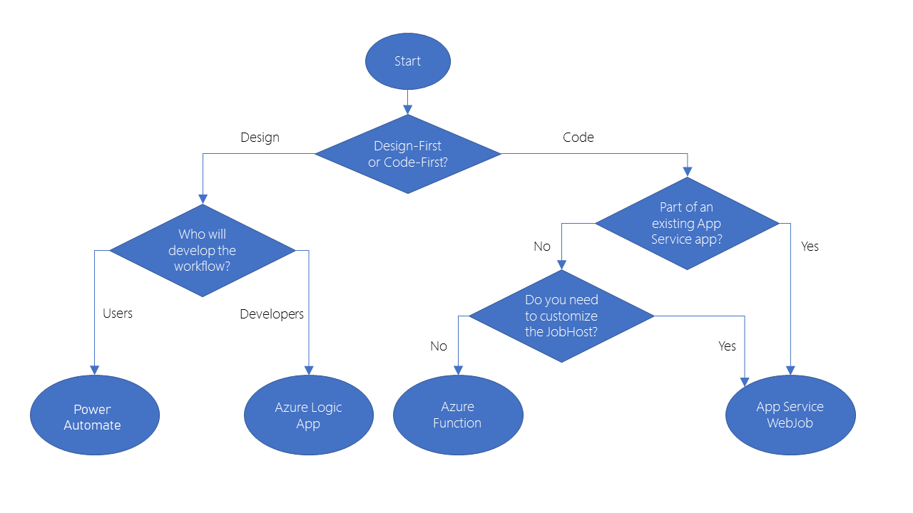

# [Identify Technology options](https://docs.microsoft.com/en-us/learn/modules/choose-azure-service-to-integrate-and-automate-business-processes/1-introduction)

Business processes modeled in software are often called *workflows*. Azure includes four different technologies that you can use to build and implement workflows that integrate multiple systems:

- Logic Apps
- Microsoft Power Automate
- WebJobs
- Azure Functions

These are the similarities

- They can all accept **inputs**. An input is a piece of data or a file that is supplied to the workflow.
- They can run **actions**. An action is a simple operation that the workflow executes and may often modify data or cause another action to be performed.
- They can all include **conditions**. A condition is a test, often run against an input, that may decide which action to execute next.
- They can all produce **outputs**. An output is a piece of data or a file that is created by the workflow.

In addition, workflows created with these technologies can either start based on a schedule or they can be triggered by some external event.

## How to Choose a service

The following diagram shows a simplified flow chart to choose the best technology to use for your business process:

If you choose to use a code-first approach, your next choice is between WebJobs and Azure Functions

Because of the extra features that are included with Azure Functions, including wider ranges of trigger events and supported languages, the ability to develop test code in the browser, and the pay-per-use price model, consider Azure Functions to be your default choice. There are two situations in which WebJobs might be a better choice:

- You have an existing Azure App Service application, and you want to model the workflow within the application. This requirement means that the workflow can also be managed as part of the application, for example in an Azure DevOps environment.
- You have specific customizations that you want to make to the JobHost that are not supported by Azure Functions. For example, in a WebJob, you can create a custom retry policy for calls to external systems. This kind of policy can't be configured in an Azure Function.

### Mixing technologies

Remember that there is no requirement for you to use the same technology for different workflows: if your requirements differ, you are likely to reach a different answer at the end of your decision-making process. Furthermore, you can also call one workflow from another. For example, a workflow implemented in Microsoft Power Automate can easily call another that is built as an Azure Function.

One reason to mix the technologies used in your business processes would be to give users control over a small section of a complete workflow. Do this by implementing that section in Microsoft Power Automate, then call that flow from a Logic App, Web Job, or Function.

### [Practical Use Case](https://docs.microsoft.com/en-us/learn/modules/choose-azure-service-to-integrate-and-automate-business-processes/4-logic-apps-and-flow)

## Design-first technologies

When business analysts discuss and plan a business process, they may draw a flow diagram on paper. With Logic Apps and Microsoft Power Automate, you can take a similar approach to designing a workflow. They both include user interfaces in which you can draw out the workflow. We call this approach a design-first approach.

### Logic App

Logic Apps is a service within Azure to automate, orchestrate, and integrate disparate components of a distributed application.

You can modify workflows via Logic Apps Designer and design canvas, or alternatevely, if you prefer to work in code, you can create or edit a workflow in JSON notation by using the code view.

One reason why Logic Apps is so good at integration is that over 200 connectors are included. A connector is a Logic Apps component that provides an interface to an external service. For example, the Twitter connector allows you to send and retrieve tweets, while the Office 365 Outlook connector lets you manage your email, calendar, and contacts.

### Microsoft Power Automate

Microsoft Power Automate is a service to create workflows even when you have no development or IT Pro experience. You can create workflows that integrate and orchestrate many different components by using the website or the Microsoft Power Automate mobile app.

There are four different types of flow that you can create:

**Automated:** Starts by a trigger from some event. For example, the event could be the arrival of a new tweet or a new file being uploaded.
**Button:** Runs a repetitive task with a single click from your mobile device.
**Scheduled:** Runs on a regular basis such like once a week, on a specific date, or after 10 hours.
**Business process:** Models a business process such as the stock ordering process or the complaints procedure. The flow process can have: notification to required people; with their approval recorded; calendar dates for steps; and recorded time of flow steps.

Under the hood, Microsoft Power Automate is built on Logic Apps. This fact means that Power Automate supports the same range of connectors and actions. You can also use custom connectors in Microsoft Power Automate.

### Comparison between Logic Apps vs Microsoft Power Automate

| | **Microsoft Power Automate** | **Logic Apps** |
| - | - | - |
| **Intended users** | Office workers and business analysts | Developers and IT pros
| **Intended scenarios** | Self-service workflow creation | Advanced integration projects
| **Design tools** | GUI only. Browser and mobile app | Browser and Visual Studio designer. Code editing is possible
| **Application Lifecycle Management** | Power Automate includes testing and production environments | Logic Apps source code can be included in Azure DevOps and source code management systems.

## Code-first technologies

The developers on your team will likely prefer to write code when they want to orchestrate and integrate different business applications into a single workflow. This is the case when you need more control over the performance of your workflow or need to write custom code as part of the business process. For such people, Azure includes WebJobs and Functions.

### WebJobs and the WebJobs SDK

The Azure App Service is a cloud-based hosting service for web applications, mobile back-ends, and RESTful APIs. These applications often need to perform some kind of background task. For example, in your bike rental system, when a user uploads a photo of a bike, you may need to generate a smaller thumbnail photograph.

WebJobs are a part of the Azure App Service that you can use to run a program or script automatically. There are two kinds of WebJob:

- **Continuous.** Run in a continuous loop. For example, you could use a continuous WebJob to check a shared folder for a new photo.
- **Triggered.** Run when you manually start them or on a schedule.

To determine what actions your WebJobs takes, you can write code in several different languages:

- Shell script(Windows, PowerShell or Bash)
- Program in PHP, Python, Node.js or JavaScript
- .NET Framework or the .NET Core Framework and a .NET language such C# or VB.NET. (With support of WebJobs SDK to make the tas easier, with classes such as *JobHostConfiguration* and *HostBuilder*, which reduce the amount of code required to interact with the Azure App Service)
- The WebJobs SDK only supports C# and the NuGet package manager.

Limitations:

- AXP.NET / SDK 2.x; 
- SDK 3.x supports .NET Core

### Azure Functions

An Azure Function is a simple way for you to run small pieces of code in the cloud, without having to worry about the infrastructure required to host that code.
Support multiple languages described [here](https://docs.microsoft.com/en-us/azure/azure-functions/supported-languages)

To create an Azure Function, choose from the range of templates. 

### Comparison Azure WebJobs vs Azure Functions

| | **Azure WebJobs** | **Azure Functions** |
| - | - | - |
| Supported languages | C# if you are using the WebJobs SDK | C#, Java, JavaScript, PowerShell, and so on.
| Automatic scaling | No | Yes 
| Development and testing in a browser | No | Yes
| Pay-per-use pricing | No | Yes
| Integration with Logic Apps | No | Yes
| Package managers | NuGet if you are using the WebJobs SDK | NuGet and NPM
| Can be part of an App Service application | Yes | Yes (hosted under App Service Plan)
| Provides close control of JobHost | Yes | No
